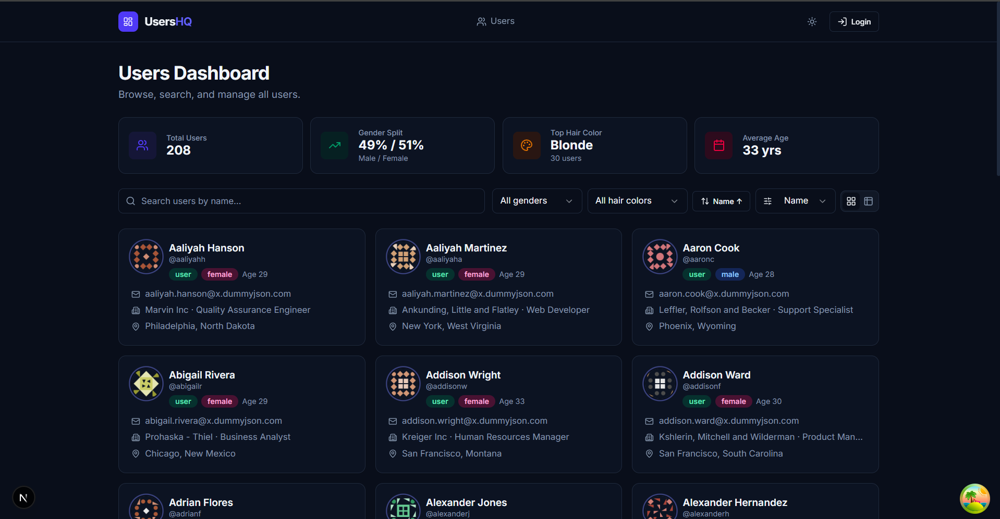
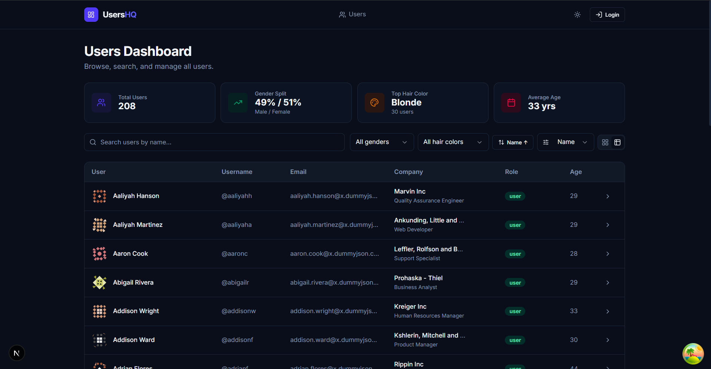
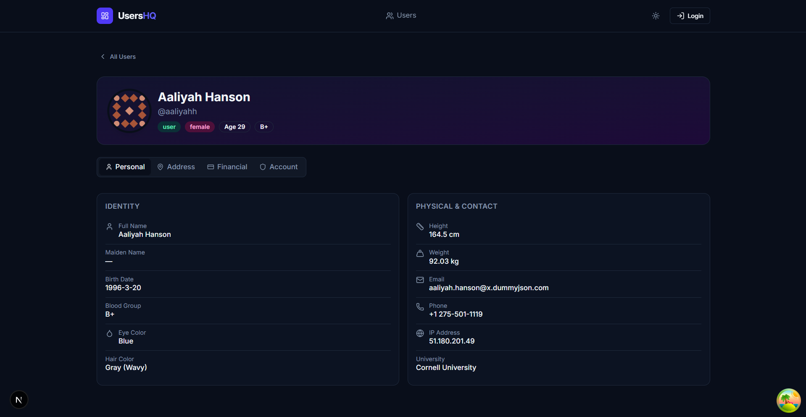
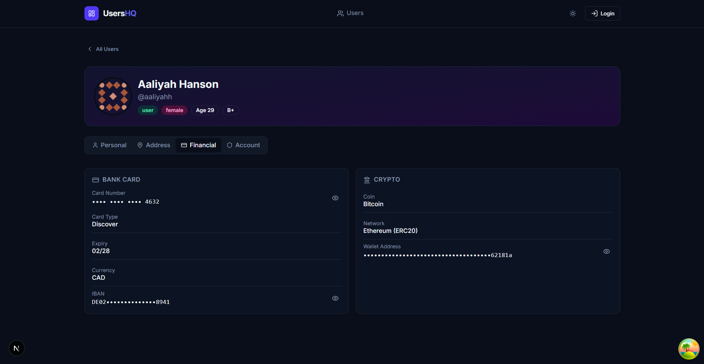
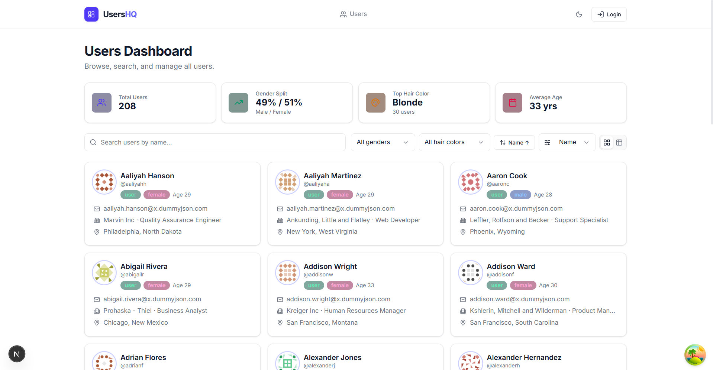

# UsersHQ — Users Dashboard

> Полноценный дашборд для управления пользователями, построенный на Next.js + TanStack Query + Tailwind CSS v4.

---

## 📸 Скриншоты

### Главная страница — вид сеткой (Grid View)


### Главная страница — табличный вид (Table View)


### Профиль пользователя — вкладка Personal


### Профиль пользователя — вкладка Financial (замаскированные данные)


### Тёмная тема



## 🛠 Стек технологий и почему именно он

### Next.js 14+ (App Router)
**Почему:** App Router — это современный стандарт React-разработки. Server Components позволяют не отправлять лишний JS клиенту. Встроенная маршрутизация на основе файловой структуры (`/users/[id]`) делает код очевидным и предсказуемым. Streaming из коробки ускоряет Time-to-First-Byte.

### TypeScript (strict mode)
**Почему:** Без строгой типизации в проекте с внешним API неизбежны баги, когда API вдруг возвращает `null` или меняет форму ответа. Все типы описаны в одном месте — `types/user.ts` — и переиспользуются по всему проекту. Нигде не используется `any`.

### Tailwind CSS v4
**Почему:** Утилитарный CSS — самый быстрый способ создать консистентный дизайн без написания кастомных `.css`-классов. Tailwind v4 убрал JS-конфиг и перешёл на `@theme` в самом CSS — меньше файлов конфигурации, больше нативного CSS. Тёмная тема реализована через CSS-переменные, которые переключаются классом `.dark` на `<html>`.

### TanStack Query (React Query) v5
**Почему:** Управлять async-состоянием вручную (loading/error/data + кэш + refetch) — это сотни строк кода. TanStack Query делает это из коробки: автоматическое кэширование, `stale-while-revalidate`, `placeholderData` (чтобы не мигал пустой экран при смене страницы), фоновые обновления, retry при ошибке. DevTools встроены — можно видеть все запросы прямо в браузере.

### Radix UI (примитивы)
**Почему:** Tabs, Select, Avatar, Dialog — все эти компоненты сложны с точки зрения доступности (keyboard navigation, ARIA-роли, focus management). Radix предоставляет эти компоненты уже доступными, но без стилей — мы сами контролируем внешний вид через Tailwind.

### lucide-react
**Почему:** Согласованный, аккуратный набор иконок. Tree-shakeable — в бандл попадают только те иконки, которые реально используются.


## 🚀 Запуск проекта

```bash
# Перейти в папку проекта
cd C:\Users\Acer\users-dashboard

# Установить зависимости
npm install

# Запустить dev-сервер
npm run dev

# Открыть в браузере
# http://localhost:3000
```

